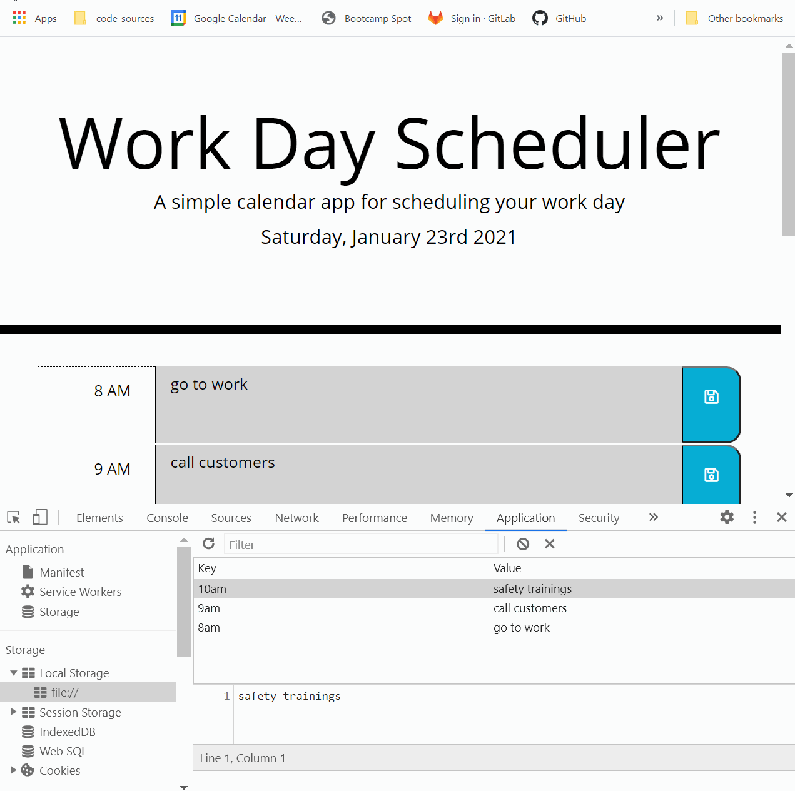

# 5_HW_Day_Planner - [Deployed product](https://victorcodrean.github.io/5_HW_Day_Planner/)


# Table of Contents

- [Description](#Description)
- [Instructions to play](#Instructions)
- [Illustration of generated password](#Illustration)
- [Framework HTML/CSS/JS](#Framework)
- [Quick GoThrough](#Gothrough)
- [Credits](#Credits)

## Description
An application consisting of a Daily calendar that allows a user to save events for the business hours of the day.
* Today's date and day of the week
    * Moment.js
* Time-blocks available for each business hour
* SaveButtons for every time-block
* Different background colors to better understand past and future events

## Instructions
* Type in your events inside the highlighted areas
* Green backgrounds stand for future events
* Red background - present event
* Gray backgrounds - past events

## Illustration


## Framework
* HTML- Content
* CSS - provided
* JS - code:
    * Moment.js
        ```
        moment().format("dddd, MMMM Do YYYY") - ("day of the week, month date year")
        moment().format("H") - ("24 hour format")
        
        ```
    * $("Jquery");
        ```
        $(this)
        $("element").each(...);
        $("element").on("click",...);

        ```
    * Database
        ```
        localStorage.setItem(key, value);
        localStorage,getItem(key);

        ```

## Gothrough
* WHEN I open the planner
* THEN the current day is displayed at the top of the calendar
* WHEN I scroll down
* THEN I am presented with time blocks for standard business hours
* WHEN I view the time blocks for that day
* THEN each time block is color-coded to indicate whether it is in the past, present, or future
* WHEN I click into a time block
* THEN I can enter an event
* WHEN I click the save button for that time block
* THEN the text for that event is saved in local storage
* WHEN I refresh the page
* THEN the saved events persist

## Credits
* List of the resources used to complete this project:
    * - [Mooment.js](https://momentjs.com/docs/#/parsing/string-format/)
    * - [W3Schools](https://www.w3schools.com/jsref/prop_win_localstorage.asp)
    * - [StackOverFlow](https://stackoverflow.com/)
    * - [Html validator](https://validator.w3.org/nu/#textarea)

## Contributing
* Name: Victor Codrean
* [Email](CodreanVictor@gmail.com)
* [GitHub](https://github.com/VictorCodrean)

## Directory
* [Deployed Website](https://victorcodrean.github.io/5_HW_Day_Planner/)
* [GitHub Source](https://github.com/VictorCodrean/5_HW_Day_Planner)